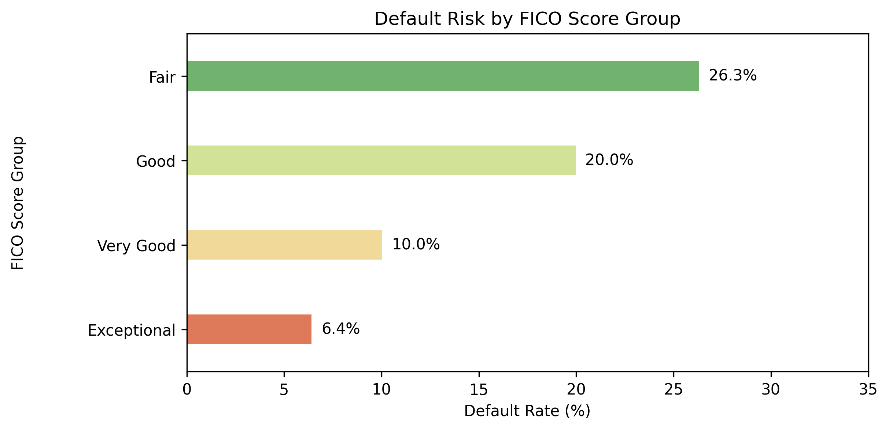
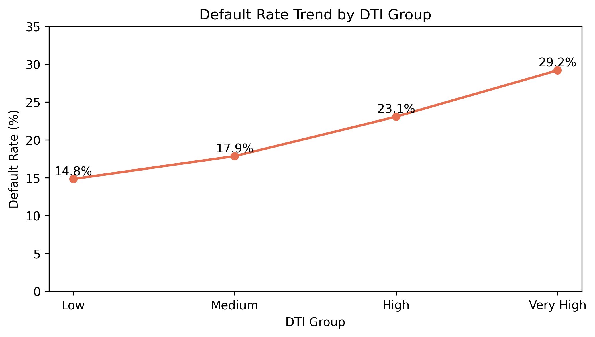
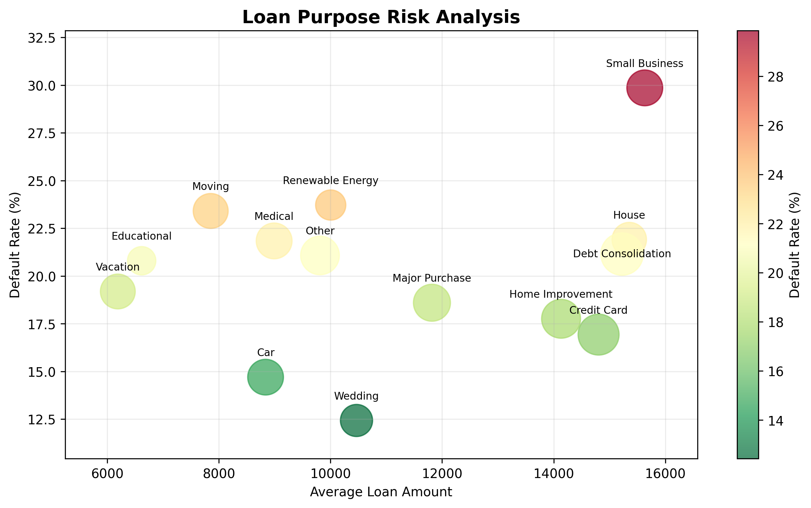

# 신용정보 데이터 기반 리스크 분석 및 활용 가능성 검토 프로젝트

## 1. 프로젝트 개요

### 프로젝트 목적

대용량 신용정보 데이터를 기반으로 데이터 품질을 검증하고, 신용평가 활용 가능 항목을 분석하여 신용정보 서비스 운영 및 활용 관점의 인사이트를 도출하는 프로젝트입니다.

본 프로젝트는 신용정보 서비스 운영 관점에서 데이터 관리부터 위험 특성 분석까지 다음 과정을 수행하였습니다.

- 데이터 적재 및 관리
- 데이터 품질 검증
- 분석 기준 정의
- 신용정보 항목 활용 가능성 검토
- 위험도 분석 및 시각화
- 운영 관점 활용 방안 도출

## 2. 프로젝트 배경 및 직무 연관성

신용정보 서비스 운영에서는 고객 데이터의 정확한 등록과 조회를 위해 데이터 품질 관리가 중요합니다.

또한 다양한 신용정보 항목이 실제 신용평가 및 위험 판단에 활용 가능한지 검토하는 과정이 필요합니다.

프로젝트 수행 과정에서 다음 업무 영역을 다루었습니다.

- 금융 데이터 처리 및 적재
- 데이터 품질 검증
- SQL 기반 데이터 조회 및 분석
- 신용 위험 분석
- 분석 결과 시각화
- 서비스 운영 관점 인사이트 도출

## 3. 데이터 소개

### Dataset

- 데이터 규모: 1,347,681건
- 컬럼 수: 15개
- 금융 대출 및 신용 관련 데이터

### 주요 활용 변수

| 컬럼 | 설명 |
|---|---|
| fico_n | FICO 신용점수 |
| dti_n | 부채 대비 소득 비율 |
| revenue | 연소득 |
| loan_amnt | 대출 금액 |
| emp_length | 근속 기간 |
| purpose | 대출 목적 |
| home_ownership_n | 주거 형태 |
| Default | 연체 여부 |

# 4. 데이터 품질 검증

## 데이터 구조 확인

확인 결과:

- 전체 데이터: 1,347,681건
- 주요 금융 데이터 컬럼 정상 존재
- 데이터 타입 및 결측 여부 확인 수행

## 중복 데이터 검증

검증 항목:

- 대출 ID 중복 여부 확인

결과:

- 중복 ID: 0건

대출 ID 기준 중복 데이터가 없음을 확인하였습니다.

## 결측 데이터 분석

| 컬럼 | 결측률 |
|---|---|
| desc | 91.16% |
| title | 1.24% |
| zip_code | 0.00007% |

주요 금융 분석 변수인 revenue, dti_n, loan_amnt, fico_n 등은 결측률이 낮아 분석에 활용하였습니다.

## 비정형 데이터 활용 검토

desc 컬럼은 대출 설명 텍스트 데이터로 활용 가능성이 있으나 높은 결측률(91.16%)을 보였습니다.

검토 기준:

- 데이터 품질
- 안정적인 운영 활용 가능성
- 분석 목적 적합성

을 고려하여 본 분석에서는 제외하였습니다.

다만 향후 텍스트 데이터 분석 시 활용 가능성이 있는 데이터로 판단하였습니다.

# 5. 데이터베이스 구축

## SQLite 기반 데이터 처리 환경 구축

대용량 금융 데이터를 효율적으로 관리하고 반복적인 분석 및 검증이 가능하도록 CSV 데이터를 SQLite 데이터베이스로 적재하였습니다.

구성:

CSV Dataset
↓
Python Pandas
↓
SQLite Database
↓
SQL Analysis

생성 테이블:

- loans

저장 데이터:

- 1,347,681건
- 15개 컬럼

## SQL 분석 과정 이슈 처리

SQLite 적재 후 SQL 조회 과정에서 Default 컬럼명이 예약어와 충돌하는 문제를 확인하였습니다.

해결 방법:

SQL 조회 시 컬럼명을 명시적으로 quoting 처리하여 `"Default"` 형태로 참조하였습니다.

이어서 6~12번이야. 그대로 README.md 아래에 붙이면 돼.
# 6. 분석 방향

## 분석 목적

신용정보 서비스에서 활용 가능한 주요 항목을 선정하고 고객군별 위험도 차이를 분석하였습니다.

### 분석 변수 선정 기준

| 변수 | 분석 목적 |
|---|---|
| FICO Score | 고객 신용 상태 및 신용 위험 평가 |
| DTI | 소득 대비 부채 부담 수준 평가 |
| Loan Purpose | 대출 목적별 위험 차이 확인 |

## 그룹별 산출 지표

각 기준별 고객군을 생성한 후 다음 지표를 산출하였습니다.

| 지표 | 의미 | 목적 |
|---|---|---|
| Customer Count | 그룹 고객 수 | 그룹 규모 및 대표성 확인 |
| Average Income | 평균 소득 | 고객 경제 수준 비교 |
| Average Loan Amount | 평균 대출금액 | 대출 규모 비교 |
| Default Rate | 부도율 | 위험 수준 평가 |

부도율뿐만 아니라 고객 규모, 소득 수준, 대출 규모를 함께 비교하여 고객군별 위험 특성을 분석하였습니다.

# 7. FICO Score Analysis

## 분석 목적

FICO Score 구간별 고객 특성과 부도율을 비교하여 신용점수가 위험도를 구분하는 기준으로 활용 가능한지 검증하였습니다.

## FICO 기준

| Score | 등급 |
|---|---|
| 300~579 | Poor |
| 580~669 | Fair |
| 670~739 | Good |
| 740~799 | Very Good |
| 800+ | Exceptional |

## 분석 결과

Poor(300~579) 구간의 데이터는 존재하지 않았으며 Fair 이상 구간을 대상으로 FICO Score별 부도율 차이를 분석하였습니다.

## FICO 분석 결과

| FICO Group | Customer Count | Avg Income | Avg Loan Amount | Default Rate |
|---|---:|---:|---:|---:|
| Fair | 238,506 | 70,388 | 12,606 | 26.30% |
| Good | 963,883 | 77,672 | 14,715 | 19.97% |
| Very Good | 129,847 | 85,622 | 15,321 | 10.04% |
| Exceptional | 15,445 | 96,948 | 15,404 | 6.41% |

## Insight

신용점수가 낮은 고객군에서 상대적으로 높은 부도율이 나타났습니다.

FICO Score는 고객 신용 수준을 구분하는 기준으로 활용 가능성을 확인하였습니다.

# 8. DTI Analysis

## 분석 목적

DTI 수준별 고객 특성과 위험도를 분석하여 상환 부담과 부도 위험의 관계를 확인하였습니다.

## DTI 분석 결과

| DTI Group | Customer Count | Avg Income | Avg Loan Amount | Default Rate |
|---|---:|---:|---:|---:|
| Low | 245,174 | 95,191 | 13,507 | 14.84% |
| Medium | 563,230 | 79,805 | 14,607 | 17.85% |
| High | 410,172 | 67,973 | 14,713 | 23.07% |
| Very High | 129,105 | 62,758 | 14,286 | 29.20% |

## Insight

DTI가 증가할수록 부도율이 상승하는 패턴을 확인하였습니다.

상환 부담 수준이 높은 고객군에서 부도율이 높게 나타나는 패턴을 확인하였습니다.

# 9. Loan Purpose Analysis

## 분석 목적

대출 목적별 고객 특성과 위험 수준 차이를 분석하였습니다.

## Loan Purpose 분석 결과 (높은 위험 목적군)

| Purpose | Customer Count | Avg Income | Avg Loan Amount | Default Rate |
|---|---:|---:|---:|---:|
| Small Business | 15,575 | 92,454 | 15,632 | 29.86% |
| Renewable Energy | 936 | 74,787 | 10,004 | 23.72% |
| Moving | 9,520 | 70,368 | 7,853 | 23.41% |

## Insight

대출 목적별 부도율 차이를 확인하였으며, 부도율이 높은 주요 목적군을 중심으로 비교 분석하였습니다.

특히 Small Business 목적 고객군에서 가장 높은 부도율이 확인되어 Loan Purpose 정보가 위험 수준 비교를 위한 보조 지표로 활용 가능함을 확인하였습니다.

# 10. 종합 위험 요인 분석

각 분석 기준에서 가장 높은 위험 그룹을 비교하였습니다.

| 분석 기준 | 위험 그룹 | 부도율 |
|---|---|---:|
| FICO Score | Fair | 26.30% |
| DTI | Very High | 29.20% |
| Loan Purpose | Small Business | 29.86% |

# 11. 최종 인사이트 및 활용 방안

분석 결과 단일 신용정보 항목보다 여러 항목을 활용할 때 고객별 위험 특성을 더 다양하게 파악할 수 있음을 확인하였습니다.

## 주요 활용 변수

### FICO Score

- 고객 신용 상태 평가
- 신용 위험 분류 기준 활용

### DTI

- 상환 부담 수준 평가
- 대출 심사 시 위험 수준 판단 기준으로 활용 가능

### Loan Purpose

- 대출 목적별 위험 차등 관리
- 특정 목적군 추가 심사 기준 활용

본 프로젝트는 예측 모델 개발이 아닌, 신용정보 항목별 위험 특성과 활용 가능성을 분석하는 것을 목적으로 수행하였습니다.

최종적으로 신용 수준(FICO), 상환 부담(DTI), 대출 목적(Purpose)을 함께 고려하는 방식이 고객 위험 특성 분석 및 신용정보 활용 기준 마련에 활용 가능하다고 판단하였습니다.

# 12. 기술 스택

## Programming

- Python
- Pandas
- NumPy

## Database

- SQLite
- SQL

## Analysis

- 데이터 품질 검증
- SQL 기반 데이터 분석
- 금융 리스크 분석
- 신용정보 활용 가능성 검토

## Visualization

- Matplotlib
- Seaborn
